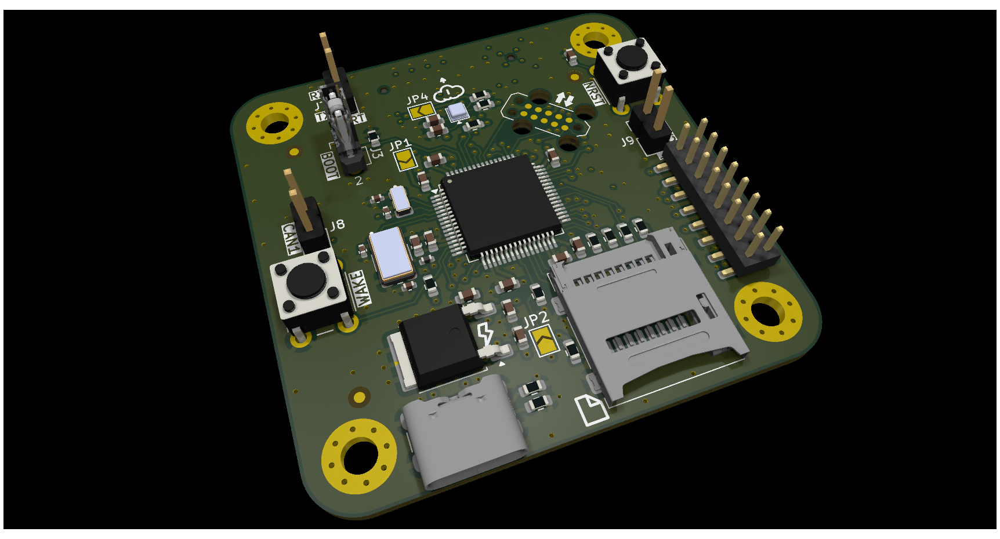

# nerve_pcb

Production optimized PCB for the STM32
based [nerve](https://github.com/danielljeon/nerve) controller firmware.

  
Table of Contents

<!-- TOC -->
* [nerve_pcb](#nerve_pcb)
  * [1 Overview](#1-overview)
  * [2 Board Specifications](#2-board-specifications)
    * [2.1 Connectors](#21-connectors)
    * [2.2 Switches & Jumpers](#22-switches--jumpers)
  * [💖 Sponsors](#-sponsors)
    * [PCBWay](#pcbway)
      * [Why PCBWay?](#why-pcbway)
<!-- TOC -->

---

This project is sponsored by [**PCBWay**](https://www.pcbway.com). You
can learn more about their valuable support here: [PCBWay](#pcbway).

---

## 1 Overview

|                               Top                               |                                Bottom                                 |
|:---------------------------------------------------------------:|:---------------------------------------------------------------------:|
|                     |                     |
|  |  |

- Bottom row pictures show 4 Layer assembly variant of `nerve_pcb`,
  v0.1.0-alpha.

---

## 2 Board Specifications

### 2.1 Connectors

Connectors fixed by hardware (PCB traces or the connector itself).

| Connector                       | Ref | Description                                                                    |
|---------------------------------|:---:|--------------------------------------------------------------------------------|
| Tag-Connect TC2050              | J1  | Programming/debug connector                                                    |
| USB-C 5 V Power                 | J2  | Power only USB-C, primary 5 V source                                           |
| BOOT0 Jumper                    | J3  | Open for run flash memory (pull-down on open)                                  |
| Hinge microSD Card              | J4  | Portable storage, see [Molex product video](https://youtu.be/YY2V8z6UK7M?t=95) |
| Top side 2x8 board-to-board     | J5  | See schematic/layout for details                                               |
| Bottom side 2x15 board-to-board | J6  | See schematic/layout for details                                               |
| CAN1 (Transceiver U7)           | J7  | Pin 1: CAN1 High, Pin 2: CAN1 Low                                              |
| CAN2 (Transceiver U8)           | J8  | Pin 1: CAN2 High, Pin 2: CAN2 Low                                              |

### 2.2 Switches & Jumpers

User controllable hardware and/or firmware driven inputs.

| Switch/Jumper           | Ref | Description                                    |
|-------------------------|:---:|------------------------------------------------|
| MCU NRESET Switch       | SW1 | Generic 6 mm TH button, push to reset          |
| MCU PA0 Switch          | SW2 | Generic 6 mm TH button, designed for SYS_WKUP0 |
| MCU Vbatt               | JP1 | Bridge to short 3.3 V supply to Vbatt          |
| SDIO Card Detect Jumper | JP2 | Open = card inserted, closed = not inserted    |
| BMP390 I2C Address      | JP3 | Open = `0x76`, closed = `0x77`                 |

---

## 💖 Sponsors

### PCBWay

This project is sponsored by [**PCBWay**](https://www.pcbway.com), whose PCB
manufacturing services are essential in producing high-quality prototypes for
its development. Their support ensures reliable boards that meet the project's
demands.

#### Why PCBWay?

PCBWay stands out for their exceptional services and commitment to the
community:

- **PCB Manufacturing**: High-quality fabrication with options for multilayer,
  rigid-flex, and advanced designs.
- **PCB Assembly**: Comprehensive solutions, including soldering, component
  sourcing, and assembly.
- **CNC Machining & 3D Printing**: Additional prototyping options to support
  complete product development.
- **Fast Turnaround**: Reliable and quick production times to keep projects on
  schedule.
- **Support for Open Source & Education**: PCBWay actively sponsors projects and
  provides educational resources like tutorials, videos, and documentation,
  empowering developers and hobbyists.
    - This commitment to education and open-source advocacy was a key factor in
      choosing them as a partner 🙂.

Their dedication to professional-grade services and fostering innovation makes
PCBWay an invaluable partner in bringing this project to life.

Learn more here: [Why PCBWay?](https://www.pcbway.com/why.html)
